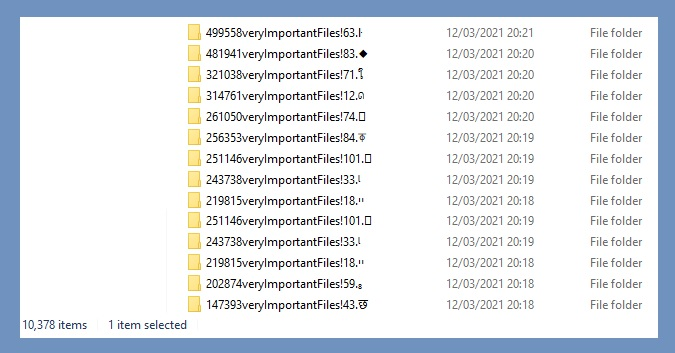

# PY3_MakeCopyChaos
Copy files from one location to another until disk is full. It will all be organized in folders similar to a hell of chaos.

Slow but useful method for overwriting clusters from deleted files.

